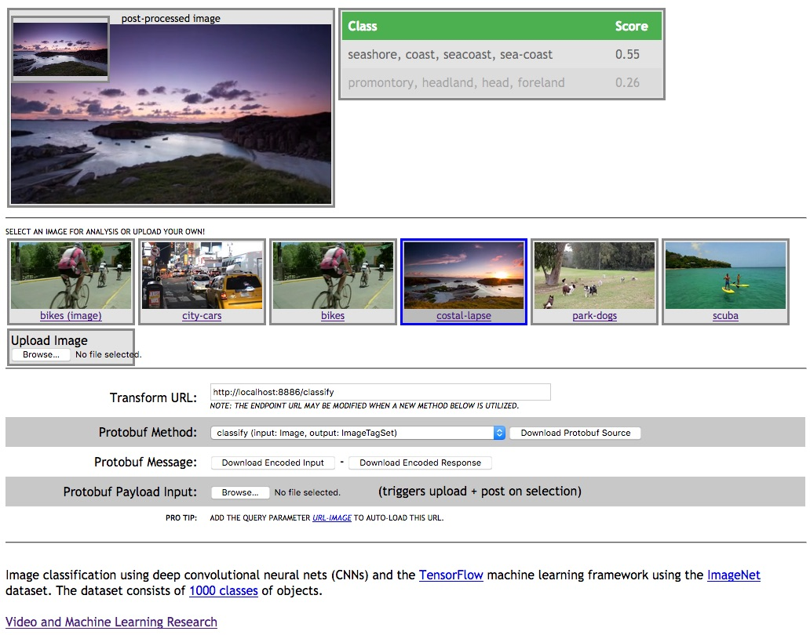

.. ===============LICENSE_START=======================================================
.. Acumos CC-BY-4.0
.. ===================================================================================
.. Copyright (C) 2017-2018 AT&T Intellectual Property & Tech Mahindra. All rights reserved.
.. ===================================================================================
.. This Acumos documentation file is distributed by AT&T and Tech Mahindra
.. under the Creative Commons Attribution 4.0 International License (the "License");
.. you may not use this file except in compliance with the License.
.. You may obtain a copy of the License at
..
..      http://creativecommons.org/licenses/by/4.0
..
.. This file is distributed on an "AS IS" BASIS,
.. WITHOUT WARRANTIES OR CONDITIONS OF ANY KIND, either express or implied.
.. See the License for the specific language governing permissions and
.. limitations under the License.
.. ===============LICENSE_END=========================================================

.. _demonstration:

==================================
Demonstrations: Tutorial for Demos
==================================

To extend functionality into a usable web-demo, a second set of assets were
created within the ``web_demo`` directory.

This web page sample uses an HTML5 player to play an mp4 video and submit its
frames to an image classification service.

**Video Copyrights May Apply** - the included sample videos may carry
additional copyrights and are not meant for public resale or consumption.

* `video/stock-footage-bicycles.mp4 <https://videos.pexels.com/videos/mountain-bikers-during-daytime-857083>`_
* `video/stock-footage-city-cars.mp4 <https://videos.pexels.com/videos/cars-on-the-road-854745>`_
* `video/stock-footage-coast-time.mp4 <https://videos.pexels.com/videos/sunset-by-the-sea-857056>`_
* `video/stock-footage-dogs.mp4 <https://videos.pexels.com/videos/dogs-playing-853846>`_
* `video/stock-footage-squirrel.mp4 <https://videos.pexels.com/videos/squirrel-eating-855213>`_
* `video/stock-footage-scuba.mp4 <https://videos.pexels.com/videos/paddle-surfing-and-scuba-diving-video-854387>`_

Browser Interaction
===================
Most browsers should have no
CORS or other cross-domain objections to dropping the file ``image-classes.html``
into the browser and accesing a locally hosted server API, as configured
in `the deployment tutorial <deployment.rst>`_.

Open-source hosted run
-----------------------
Utilizing the generous `htmlpreview function <https://htmlpreview.github.io/>`_ available on
GitHub, you can also experiment with the respository-based web resource.  This resource
will proxy the repository ``web_demo`` directory into a live resource.

Navigate to the `default webhost page <http://htmlpreview.github.io/?https://github.com/acumos/image-classification/blob/master/web_demo/image-classes.html>`_
and confirm that the resource load properly.  The image at the bottom of this guide
is a good reference for correct page loading and display.

After confirming correct page load, simply replace the value in the ``Transform URL``
field to point at your deployed instance.  For example, if you've created a
dumped model locally, it might be a localhost port.

Local webserver run
-----------------------
If you want to run the test locally, you can use the built-in python
webserver with the line below while working in the ``web_demo`` directory
(assuming you're running python3).

.. code:: bash

    python -m http.server 5000

Afterwards, just point your browser at ``http://localhost:5000/image-classes.html``.

Example image classification demo (docker and protobuf)
=======================================================
To customize this demo, one should change either the included javascript
or simply update the primary classification URL on the page itself during runtime.
This demo utilizes the `javascript protobuf library <https://github.com/dcodeIO/ProtoBuf.js/>`_
to encode parameters into proto binaries in the browser.

** NOTE ** One version of the face model's protobuf schema is included with
this web page, but it may change over time.  If you receive encoding errors
or unexpected results, please verify that your target model and this web page
are using the same ``.proto`` file.

* confirm that your target docker instance is configured and running
* download this directory to your local machine
    * confirm the host port and classification service URL in the file ``image-classes.js``
    * modify the ``protoDefault`` setting to be 1

.. code:: bash

    urlDefault: "http://localhost:8886/classify",

* view the page ``image-classes.html`` in a Crome or Firefox browser
* you can switch between a few sample images or upload your own by clicking on the buttons below the main image window

Special decoding example
------------------------
In ``protobuf`` mode, you can also download a binary, encoded version of the last
image or output that was sent to the remote service.  When available, the **Download Encoded Message**
button will be enabled and a binary file will be generated in the browser.

.. code:: bash

    protoc --decode=ZmazgwcYOzRPSlAKlNLcoITKjByZchTo.ImageTagSet model.proto < protobuf.out.bin
    protoc --decode=ZmazgwcYOzRPSlAKlNLcoITKjByZchTo.Image model.proto < protobuf.in.bin

**NOTE** The specific package name may have changed since the time of writing,
so be sure to check the contents of the current ``.proto`` file.

