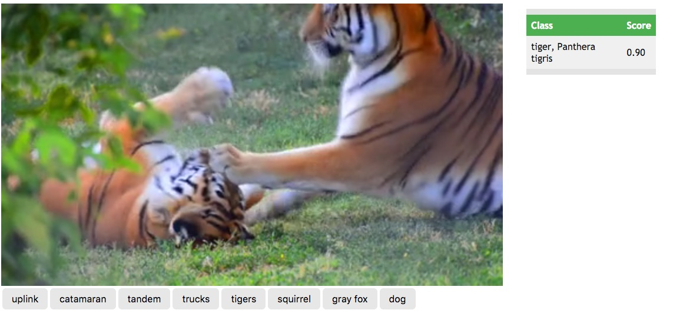

# Image Classifier Example
This web page sample uses an HTML5 player to play an mp4 video and submit its
frames to an image classification service.

** Video Copyrights May Apply ** - the included sample videos may carry
additional copyrights and are not meant for public resale or consumption.

## Example classification demo
To utilize this demo...

* confirm that your local instance is configured and running
* download this directory to your local machine
  * confirm the host port and classification service URL in the file `image-classes.js`
```
classificationServer: "http://localhost:8885/classify",
```

* view the page `image-classes.html` in a Crome or Firefox browser (sorry other browsers may not properly serve the HTML5 video tag)
* probabilities will be updated on the right side fo the screen
* you can switch between a few sample videos by clicking on the buttons below the main video player
* 
